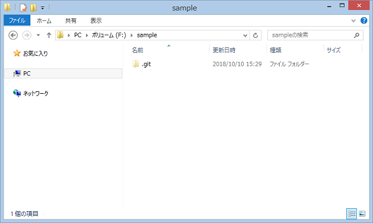
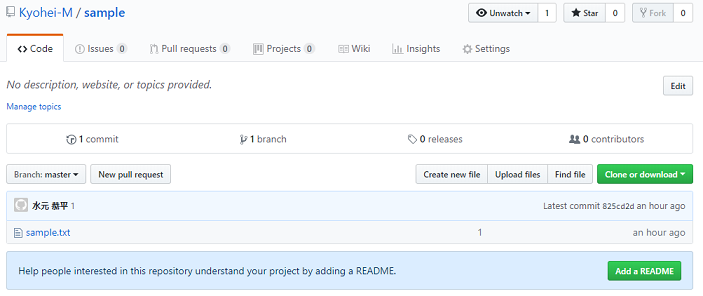
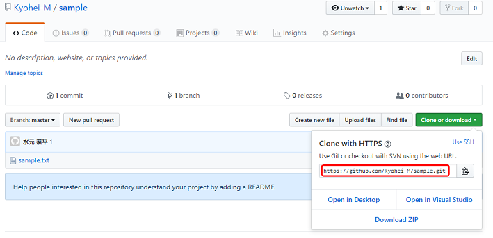

name: inverse
layout: true
class: center, middle, inverse
---
# Git入門

---
layout: false

### 対象者

* git未経験者

* 基本的なコマンド操作可能

---
### 目標

* 基本的なgitコマンド操作ができるようになる

* githubの操作ができるようになる

---
### Gitとは

* 変更履歴を記録・追跡するためのバージョン管理システム

* ローカル環境で操作

* 差分ではなくスナップショット

---
### リポジトリ
ファイルやディレクトリの状態を記録する場所。リモートリポジトリとローカルリポジトリがある

---
### ブランチ
履歴の流れを分岐して記録していくためのもの

---
### インストール

公式サイト(<u><https://git-scm.com></u>)よりダウンロード


---
### インストール

インストール完了後、gitコマンドが使用可能になる

```console
# バージョン確認
$ git version
git version 2.19.1.windows.1

# ヘルプ表示
$ git --help
```

---
class: center, middle, inverse
# gitコマンド
## ローカル編

---
### 覚えるべきgitコマンド

* git init

* git add

* git commit

---
### git init

.left-half[
空のgitリポジトリを作成

```console
$ mkdir sample
$ cd sample
$ git init
```
]

.right-half[

<br/>

<center></center>
]

---
### git add

ファイルをバージョン管理対象として追加する

```console
$ echo sample > sample.txt
$ git add sample.txt
```

全ファイルを追加したい場合

```console
$ git add .
```

---
### git commit

変更内容をリポジトリに追加する

```console
$ git commit -m "comment"
```

---
class: center, middle, inverse
# githubの利用

---
### アカウント作成

<u><https://github.com/></u>


---
### リポジトリの作成

<u><https://github.com/new></u>


---
### リポジトリの作成

作成したリポジトリのパスをコピー


---
class: center, middle, inverse
# gitコマンド
## リモート編

---
### 覚えるべきgitコマンド

* git remote

* git push

* git pull

* git clone

---
### git remote
リモートリポジトリの操作を行う

```console
# リモートリポジトリを追加
$ git remote add origin [リポジトリのパス]

# 登録されているリモートリポジトリの確認
$ git remote -v
origin  https://github.com/Kyohei-M/sample.git (fetch)
origin  https://github.com/Kyohei-M/sample.git (push)
```

---
### git push
リモートリポジトリにコミットをプッシュする

```console
$ git push origin master
```



---
### git pull

リモートリポジトリと同期する

```console
$ git pull origin master
```

---
### git clone
リポジトリをローカルに複製する

```console
$ git clone [リモートリポジトリのパス]
```



---
class: center, middle, inverse
# 注意点

---
### githubとsshキー
githubの操作には、ローカルマシンのsshキーを設定する必要がある


---
### sshキーの作成

.zoom1[ 
<u><https://confluence.atlassian.com/bitbucketserver/creating-ssh-keys-776639788.html></u>
]

```console
$ ssh-keygen -t rsa -C "your_email@example.com"
```

作成される".ssh\id_rsa.pub"の中身をgithubにコピー

---
class: center, middle, blue
# おまけ

---
### Sourcetree

GitのGUIツール。使いやすいらしい(使ったことない)  
<u><https://www.sourcetreeapp.com/></u>


---
class: center, middle, blue
### 皆さん、Gitを使いましょう！

---
### 参考

公式サイト  
<u><https://git-scm.com/></u>

Wikipedia  
<u><https://ja.wikipedia.org/wiki/Git></u>

サルでもわかるGit入門  
<u><https://backlog.com/ja/git-tutorial/></u>